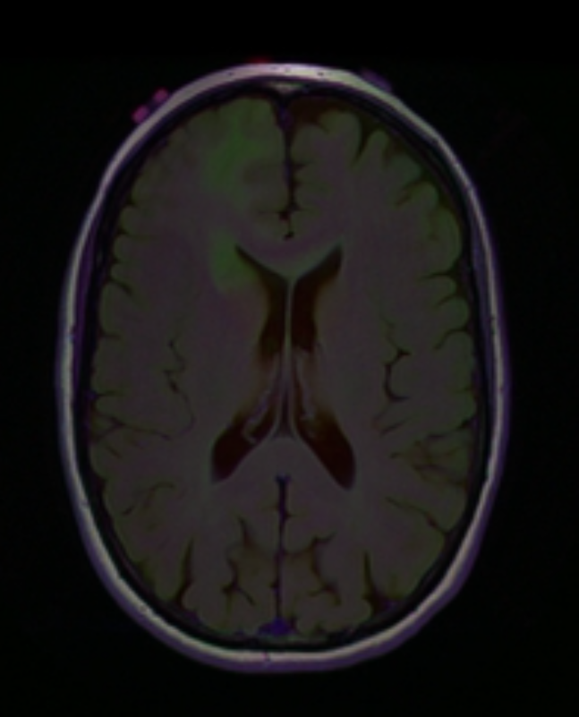
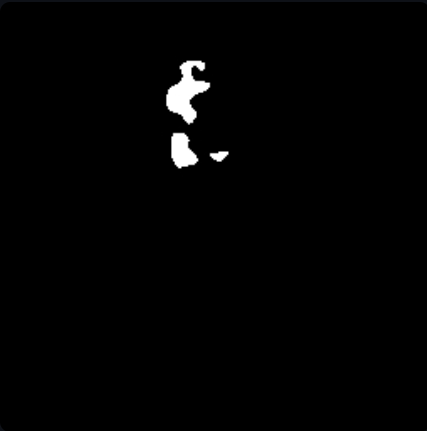
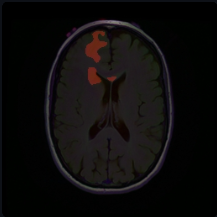

# 🧠 Automated Brain Tumor Segmentation via U-Net Architecture

## 📌 Overview
Manual segmentation of brain tumors from MRI scans is a labor-intensive task prone to human subjectivity. This project develops an automated, end-to-end Deep Learning pipeline using the **U-Net architecture** to perform pixel-wise segmentation of tumor regions with high precision.

The project was developed as the final deliverable for the **Intelligent Systems** course at Helwan National University, achieving a **Dice Coefficient of 0.86**.

---

## 🛠️ Technical Methodology

### 1. Data Pre-processing
To ensure the model focuses on the relevant features, the following pipeline was applied:
* **Normalization:** Scaling pixel values to a range of [0, 1].
* **Resizing:** Standardizing all MRI slices to `256x256` pixels.
* **Data Augmentation:** Applied rotation, zooming, and flipping to increase model robustness and prevent overfitting.

### 2. Architecture: U-Net
We utilized a classic U-Net structure characterized by its symmetric Encoder-Decoder paths:
* **Encoder:** 4 stages of Convolutional layers followed by Max-Pooling to capture hierarchical features.
* **Decoder:** Symmetric Up-sampling layers to restore spatial resolution.
* **Skip Connections:** Bridging the Encoder and Decoder to preserve fine-grained spatial details, which is crucial for identifying tumor boundaries.

### 3. Loss Function & Optimization
Given the severe **Class Imbalance** (tumors occupy a small fraction of the MRI volume), we employed a **Hybrid Loss Function**:
$$Loss = BCE + (1 - Dice\_Coefficient)$$
* **Optimizer:** Adam (Learning Rate = 1e-4).
* **Early Stopping:** Implemented to monitor validation loss and prevent overfitting.

---

## 🚀 Performance Evaluation
The model demonstrates clinical-grade performance:
* **Dice Coefficient:** `0.86`
* **Mean IoU:** `0.75`
* **Pixel Accuracy:** `99.7%`

### Visual Results (Inference)
The following table showcases the model's ability to delineate tumor regions effectively:

| Input MRI Scan | Predicted Mask | Overlay View (Clinical) |
| :---: | :---: | :---: |
|  |  |  |

---

## 💻 Deployment with Streamlit
We developed a user-friendly web interface that allows users to upload MRI files and receive instant segmentation results. 

### How to run locally:
1. Clone the repository: `git clone https://github.com/SaifAzazy255/Automated-Brain-Tumor-Segmentation-via-U-Net-Architecture.git`
2. Install requirements: `pip install -r requirements.txt`
3. Run the app: `streamlit run app.py`

---

## 👥 Project Team
* **Saif Hany Abdel-Aziz**
* Ali Ahmed Zaki
* Marwan Hassan Morsy
* Mohamed Emad Eldin
* Tasnim Ahmed Mohamed

**Supervised by:** Dr. Samar M. Nour

---
*Special Note: The `model.keras` file is optimized for inference. For full training logs, please refer to the `notebooks/` directory.*
